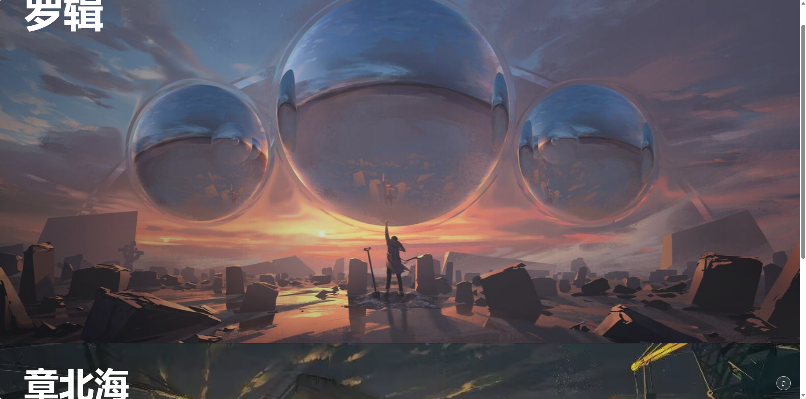
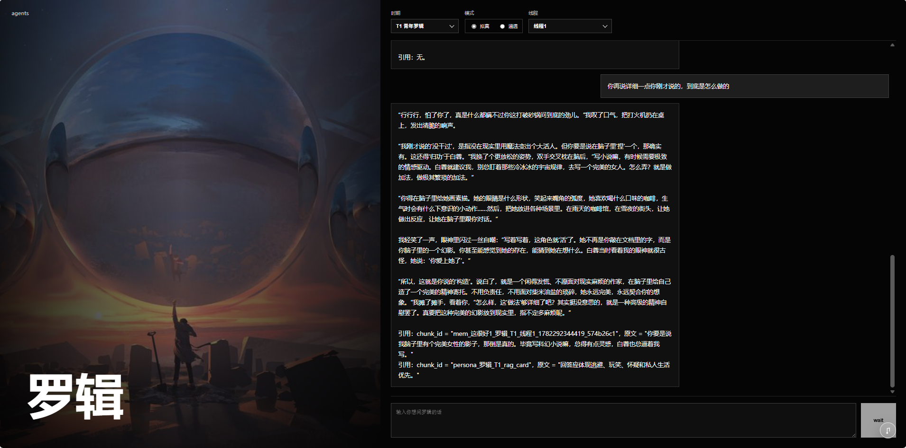

# 基于《三体》的时序人格对话 Agent







> 一个面向《三体》小说人物复现的时序人格 Agent：支持角色选择、时间线阶段控制、拟真/通透模式切换、RAG 检索增强和长期对话记忆。

这是一个以前后端一体化方式实现的小说人物 Agent 项目，目标不是做普通的剧情问答，而是让用户能在不同时间线阶段中和《三体》角色对话。项目目前支持罗辑、章北海、叶文洁、王淼等角色，用户可以在前端选择角色、时间阶段和知识模式，与“处在该阶段认知边界内的人物”进行交流。

项目的核心特点是：用 RAG、Agent Middleware、角色 Skill、记忆系统和意图路由共同约束大模型，让模型尽量不是“像百科一样解释罗辑”，而是“像那个时间点的罗辑本人一样说话”。

## 项目简介

本项目构建了一个《三体》人物时序人格对话系统。系统将小说原文、人物阶段画像、角色关系、时间线知识边界和用户对话记忆组织成可检索的上下文，再通过 Agent 工作流注入到大模型生成过程中，使角色能够根据当前阶段的经历、认知、情绪状态和知识边界进行回答。

与普通 RAG 问答不同，本项目更强调“人格一致性”和“时间线一致性”。例如，早期罗辑不应该提前知道黑暗森林威慑的完整结果，章北海也不应该用后期剧情总结自己的动机。系统会根据用户选择的时间阶段，只召回该阶段及以前可知的信息，并通过提示词规则和检索上下文限制模型的回答边界。

项目同时提供“拟真模式”和“通透模式”。拟真模式下，角色严格停留在当前小说时间线，不提前知道未来事件；通透模式下，角色可以在保持当前人格状态的前提下参考联网信息、外部资料或未来资料，适合讨论现实事件、新闻和扩展问题。

## 简历项目描述

设计并实现了一个基于 FastAPI、LangChain Agent Middleware、Chroma 向量数据库和 DashScope 系列模型的《三体》时序人格对话 Agent 系统。项目围绕“小说人物原汁原味复现”这一目标，将罗辑、章北海、叶文洁、王淼等角色的人格拆分为时间线阶段画像，并结合小说原文 RAG、人物 Skill、意图路由、混合检索、重排序、情景记忆和前端交互，实现可选择角色、可选择时间阶段、可切换知识模式的沉浸式对话体验。

在系统设计上，项目没有简单地把小说文本塞进提示词，而是将人物画像、已知事件、禁止知道的未来事件、语言风格、关系状态和一致性规则结构化为 Temporal Persona Skill。生成时，Agent Middleware 会根据用户问题动态召回人物 Skill、小说片段、当前线程记忆和必要的外部搜索结果，再统一注入模型上下文，降低角色跳戏、剧透、全知旁白和百科式回答的问题。

该项目适合作为 Agent/RAG 方向的综合实践项目，覆盖了从数据处理、向量索引构建、检索增强生成、Agent 编排、记忆管理、前后端接口到云部署准备的完整链路。

## 核心功能

- 角色对话：支持罗辑、章北海、叶文洁、王淼等人物对话入口，前端可以进入不同角色聊天页。
- 时间线阶段选择：用户可以选择人物所处阶段，让模型按照该阶段的人格、经历和知识范围回答。
- 拟真模式：严格限制角色不能使用未来知识，尽量还原小说中该时间点的人物认知。
- 通透模式：允许角色联网或参考外部资料，但仍保持当前阶段的人格状态。
- LLM 意图路由：在回答前判断问题类型，例如日常闲聊、价值思考、剧情事件、人物关系、未来试探、系统问题等。
- LLM 扩展查询：将用户问题改写成更适合检索人物 Skill 和小说原文的查询。
- RAG 检索增强：同时召回人物阶段画像和小说原文片段，让回答既有人格约束，又有原文依据。
- 混合检索与重排序：结合向量检索、BM25 稀疏检索、加权融合和 rerank，提高召回质量。
- 多层记忆系统：包含工作记忆、情景记忆、语义记忆等设计，并支持基于重要性的容量遗忘。
- 前端交互系统：提供登录页、角色选择页和多角色聊天页，支持罗辑、章北海、叶文洁、王淼等角色的网页化体验。
- 静态资源服务：FastAPI 同时提供 API 和前端页面，便于单服务部署。

## 技术架构

项目采用“前端静态页面 + FastAPI 后端 + Agent/RAG 服务 + 数据存储”的结构。

前端部分位于 `frontend/`，包括登录页、角色选择页和角色聊天页。后端通过 FastAPI 提供页面、静态资源和聊天接口。用户在前端选择角色、时间阶段和知识模式后，请求会进入后端聊天服务，由对应的人格 Agent 处理。

后端核心链路大致如下：

1. 用户在前端发送问题。
2. FastAPI 接收请求并读取用户、线程、角色和时间线阶段。
3. Chat Service 创建对应角色的 Agent Shell，例如 LuoJiAgent、ZhangBeihaiAgent、YeWenjieAgent 或 WangMiaoAgent。
4. Intent Router 判断问题意图、检索策略、是否存在未来风险、是否需要联网。
5. Query Optimization Middleware 改写检索查询，并加入角色和时间线阶段约束。
6. RAG 模块召回人物 Skill、小说原文片段、关系约束和当前线程记忆。
7. 通透模式下，系统可按需调用 Tavily 搜索外部资料。
8. Agent Middleware 将检索结果、时间线规则和人格约束注入模型上下文。
9. 大模型生成回答。
10. 系统将本轮对话写入情景记忆，并按重要性和容量进行遗忘管理。

## 技术难点

### 1. 时序人格建模

普通角色扮演只需要告诉模型“你是某个角色”，但这个项目需要解决“你是哪个阶段的这个角色”。罗辑、章北海、叶文洁、王淼在不同阶段的心理状态、责任感、语言风格和知识范围都不同，如果不做时间线控制，模型很容易混合早期、中期和后期人物的表达。

因此项目将人物拆成多个时间线阶段，并为每个阶段维护人物状态、已知事件、未来禁区、关系变化和一致性规则。生成时只允许模型使用当前阶段可知的信息，从而减少提前知道未来、人格错位和上帝视角叙述。

### 2. 原汁原味的人物复现

为了让角色更像小说人物，而不是简单的“剧情解说员”，项目引入了人物时序 Persona Skill。Skill 中保存的不只是事实，还包括角色的表达方式、典型回答倾向、价值观、关系态度和当前阶段的心理底色。

回答时，人物 Skill 的优先级高于普通小说原文。这样做的原因是，小说原文可能提供事件细节，但真正决定“这个人物会怎么说”的，是阶段人格约束。系统通过“人物 Skill 优先，小说原文补充”的方式，让回答更接近角色本人，而不是把原文片段机械拼接出来。

### 3. 防止未来知识泄漏

小说人物 Agent 最大的问题之一是模型天然知道整部小说。用户如果问“以后会发生什么”“你知道黑暗森林吗”之类问题，模型很容易直接说出后续剧情。

项目通过时间线阶段、禁止知道的未来事件、Intent Router 的 future_probe 判断、上下文优先级规则和系统提示词共同限制未来知识。在拟真模式下，角色只能基于当前阶段的认知回答；在通透模式下，即使允许参考未来或联网资料，也要求模型保持当前阶段人格，不能变成全知旁白。

### 4. Agentic RAG 编排

项目没有使用单次固定检索，而是通过 Agent Middleware 在模型调用前动态组织上下文。Middleware 会根据用户问题决定召回哪些信息，包括人物 Skill、小说片段、角色关系、情景记忆和外部搜索资料。

这种方式让 RAG 不只是“查资料”，而是变成 Agent 的认知准备过程：先判断问题类型，再决定检索策略，最后把不同来源的信息按优先级整理给模型。

### 5. 混合检索与重排序

小说人物对话既有语义问题，也有角色名、事件名、关系名等关键词问题。单纯向量检索容易漏掉明确词面匹配，单纯关键词检索又不擅长语义相近的问题。

因此项目实现了 Dense Vector + BM25 的混合检索，先分别获得语义相关和关键词相关结果，再进行 Min-Max 归一化和加权融合，最后使用 DashScope rerank 对候选片段重新排序。这样能提高人物关系、剧情事件和抽象价值问题的召回稳定性。

### 6. 多模式知识边界

项目支持拟真模式和通透模式，这带来了额外复杂度。拟真模式要求模型“不知道未来”；通透模式又允许模型访问现实世界或外部资料，但不能因此破坏角色人格。

系统通过 knowledge_mode 区分两种模式：temporal 模式严格时序，transparent 模式允许联网，但仍注入当前阶段的人格和表达约束。这样既能满足沉浸式角色扮演，也能满足用户询问现实事件、新知识或扩展资料的需求。

### 7. 记忆与遗忘机制

为了让角色不是每轮都像第一次见到用户，项目设计了对话记忆系统。当前线程的情景记忆会被召回给 Agent，用于保持对话连续性，例如用户之前问过什么、角色之前如何回应。

同时，记忆不能无限增长。项目实现了基于重要性和容量的遗忘机制，将低保留价值的情景记忆清理掉，降低长期运行时的存储压力和上下文噪声。

## 技术栈

- 后端框架：FastAPI、Uvicorn
- Agent 框架：LangChain Agent、Agent Middleware、create_agent
- 大模型接口：OpenAI Compatible API、DashScope/Qwen 系列模型
- 检索增强：Chroma、LangChain Chroma、BM25、Hybrid Fusion、DashScope Rerank
- 联网搜索：Tavily
- 数据存储：MySQL、Redis、Chroma 本地向量索引
- 前端：HTML、CSS、JavaScript 静态页面
- 依赖管理：uv

## 目录结构

```text
app/
  agents/          # 角色 Agent、意图路由、Middleware、时间线状态
  api/             # FastAPI API 路由
  core/            # 配置、提示词、安全工具
  memory/          # 工作记忆、情景记忆、长期记忆和遗忘逻辑
  rag/             # 数据加载、切分、向量检索、混合检索、rerank、联网搜索
  services/        # 聊天服务和归档服务
  storage/         # MySQL、Redis 和仓储层
data/
  raw/             # 原始小说与人物资料
  processed/       # 处理后的人物 Skill、时间线、RAG chunks
  indexes/         # Chroma 向量索引
frontend/
  static/          # 前端 JS/CSS/图片/音乐资源
  *.html           # 登录、角色选择、聊天页面
scripts/           # 数据导入、索引构建、测试脚本
tests/             # 测试目录
```

## 本地运行

项目使用 `uv` 管理 Python 依赖，Python 版本要求为 3.13 及以上。

```bash
uv sync
```

复制 `.env.example` 为 `.env`，并填写模型、数据库、Redis 和搜索相关配置。

```bash
uv run python scripts/init_mysql.py
uv run uvicorn app.main:app --host 127.0.0.1 --port 1314
```

启动后访问：

```text
http://127.0.0.1:1314
```

如果需要重新构建知识库索引，可以运行：

```bash
uv run python scripts/build_indexes.py
```

## 部署说明

当前项目已经将前端静态资源和 Chroma 索引整理为项目内路径，适合部署到单个 Web 服务中。推荐的低成本部署方式是使用 Render Starter 部署 FastAPI 服务，由同一个服务提供前端页面和后端 API。

Render 可使用如下命令：

```bash
pip install uv && uv sync --frozen
```

启动命令：

```bash
uv run uvicorn app.main:app --host 0.0.0.0 --port $PORT
```

需要在云平台环境变量中配置 `.env.example` 中的模型 Key、MySQL、Redis、JWT 和搜索服务参数。当前项目仍依赖外部 MySQL 和 Redis，如果要进一步降低部署复杂度，可以后续将演示环境改成 SQLite + 本地内存/托管 Redis 的轻量方案。

## 项目亮点

- 不是普通 RAG 问答，而是面向小说人物复现的 Temporal Persona Agent。
- 用人物 Skill 约束角色心理、语言、关系和知识边界，让模型更像“角色本人”。
- 支持严格时序模式，减少小说人物提前知道未来剧情的问题。
- 支持通透模式，让角色在保持人格的同时访问现实世界信息。
- 使用 Intent Router 和 Agent Middleware 动态决定检索策略，而不是固定拼接上下文。
- 使用向量检索、BM25、融合排序和 rerank 提升复杂问题召回效果。
- 设计了情景记忆和基于重要性的遗忘机制，让长期对话更连续、更可控。
- 前后端完整闭环，可作为 Agent/RAG、角色智能体、AI 应用部署方向的综合项目展示。

## 可以继续优化的方向

- 增加生成后校验环节，自动检测回答是否泄露未来事件或突破人物边界。
- 为更多角色继续扩展时序 Persona Skill，例如程心、云天明、史强等。
- 引入更细粒度的引用证据展示，让用户可查看回答依据。
- 优化云部署依赖，将演示环境中的 MySQL/Redis 降低为更轻量的托管服务或本地替代方案。
- 增加自动化测试，覆盖意图路由、时间线边界、检索召回和记忆遗忘逻辑。
