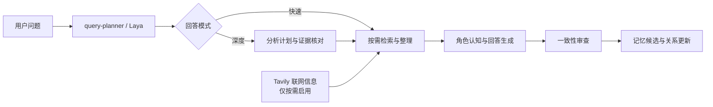
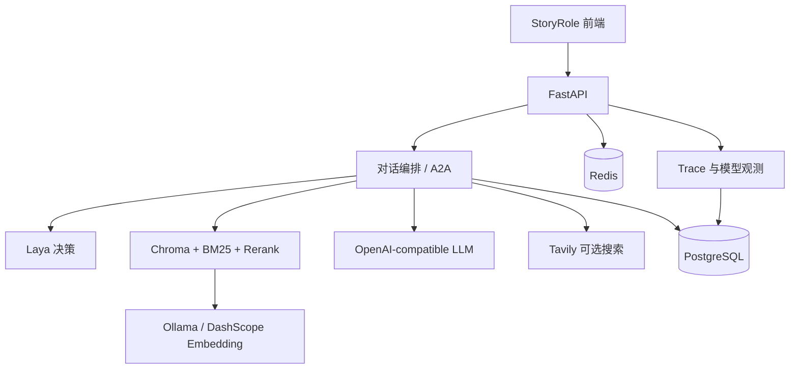

# StoryRole

> 让小说人物在属于自己的时间里思考、记忆，并与你对话。

StoryRole 是一个面向长篇小说的时序人格对话系统。用户导入小说、创建角色、选择人物时期，随后与处在该阶段认知边界内的角色交流。系统将原文证据、女娲式时期画像、动态关系和对话记忆组织成可追踪的 Agent 流程，而不是把小说当成普通问答知识库。

<p align="center">
  
  
</p>

## 项目定位

普通角色聊天往往只有一句“你是某某角色”。模型很容易混合角色不同时期的经历，提前知道未来剧情，或者变成百科解说员。StoryRole 将角色视为一套随时间变化的人格运行时：

```text
小说原文 → 结构化切分与索引 → 角色解析 → 时期画像
                                             ↓
用户问题 → Laya 问题规划 → 证据 / 记忆 / 关系 / 联网信息
                                             ↓
                         快速或深度分析 → 角色化回答
                                             ↓
                              一致性审查与状态更新
```

核心目标不是让模型“知道更多剧情”，而是让它在有限证据和明确时期边界内，以一个具体人物的方式思考和回应。

## 核心能力

| 能力 | 实现方式 |
| --- | --- |
| 任意小说导入 | TXT、Markdown、多文件导入；解析章节、结构化切分、Embedding、Chroma 与 BM25 建索引 |
| 自定义角色 | 用户输入角色名，先从原文解析，再创建档案 |
| 自定义时期 | 用户定义时期，或由模型基于原文提出时期建议；每个时期独立生成画像 |
| 女娲式人格画像 | 提炼思维框架、表达方式、知识边界、关系、目标和反模式约束 |
| 混合检索 | 向量检索 + BM25 + 融合排序；需要时使用 DashScope Rerank |
| 双回答模式 | 快速模式偏重交互速度；深度模式增加受约束的分析计划与证据整理 |
| 正交联网模式 | Tavily 外部搜索可与快速/深度组合；外部资料不能改写角色人格 |
| 对话连续性 | 会话历史、动态关系与待确认的长期记忆候选 |
| 全链路观测 | `trace_id` 串起 Agent、阶段耗时、模型调用、Token、费用和降级信息 |

## 从小说到对话

### 1. 导入与索引

小说进入系统后，依次进行解析、章节识别、结构化切分和向量化；生成 Chroma 向量索引及持久化 BM25 索引。片段保留来源、章节和检索所需元数据。Embedding 后端可选本地 Ollama 或 DashScope，结果可通过数据库缓存复用。

### 2. 角色与时期

`character-resolver` 确认角色是否出现在原文中。用户可以直接定义人物时期，也可以调用 `character-period-analysis` 获取建议。`nuwa-profiler` 为每个时期分别生成并保存画像，避免早期和后期人格、关系与知识相互污染。

时期画像不仅是角色简介，还包含角色如何判断问题、如何表达、当前阶段知道什么，以及哪些未来事件不应出现在回答中。关系状态另存于 PostgreSQL，可随对话变化。

### 3. 一次聊天如何编排


```mermaid
flowchart LR
    U[用户问题] --> Q[query-planner / Laya]
    Q --> P{回答模式}
    P -->|快速| C[按需检索与整理]
    P -->|深度| D[分析计划与证据核对]
    D --> C
    W[Tavily 联网信息<br/>仅按需启用] --> C
    C --> R[角色认知与回答生成]
    R --> G[一致性审查]
    G --> M[记忆候选与关系更新]
```

Laya 先判断本轮需要哪些资源，例如小说证据、记忆、关系和时间线核查。深度模式在此基础上生成受约束的分析计划；它不是另一个独立 Agent，也不会向用户展示内部推理。回答由角色画像、当前时期和检索证据共同约束。

| 模式 | 主要取舍 | 适用问题 |
| --- | --- | --- |
| 快速 | 较少阶段与较短上下文，保持对话节奏 | 闲聊、情绪回应、简单追问 |
| 深度 | 更多证据、关系和动机分析 | 复杂事实、跨事件推断、关系冲突 |
| 联网开关 | 独立于快速/深度，按需加入外部资料 | 现实信息与扩展问题 |

## Agent 与系统架构

| Agent | 职责 |
| --- | --- |
| `character-resolver` | 根据原文解析并保存角色 |
| `character-period-analysis` | 提出时期范围建议 |
| `nuwa-profiler` | 生成并持久化时期画像 |
| `query-planner` | Laya 问题分类与资源规划，故障时可退回规则后端 |
| `deep-question-planner` | 深度问题的受约束分析与检索计划 |
| `context-curator` | 整理画像、小说证据、记忆、关系与联网结果 |
| `character-reasoning` / `role-cognition` | 形成角色立场、情绪和表达策略 |
| `relationship-state` / `memory-decision` | 更新动态关系与长期记忆候选 |
| `consistency-guard` | 检查人格、时期和证据边界 |
| `character-conversation` | 编排完整聊天流程 |

Agent 默认通过同进程 A2A 信封调用。`STORYROLE_A2A_TRANSPORT=http` 可将部分 Agent 改为 HTTP 服务，同时保留相同的调用协议。系统也提供 Agent Card 与 JSON-RPC 接口。


```mermaid
flowchart TB
    UI[StoryRole 前端] --> API[FastAPI]
    API --> ORCH[对话编排 / A2A]
    ORCH --> LAYA[Laya 决策]
    ORCH --> RAG[Chroma + BM25 + Rerank]
    ORCH --> LLM[OpenAI-compatible LLM]
    ORCH --> WEB[Tavily 可选搜索]
    ORCH --> DB[(PostgreSQL)]
    API --> REDIS[(Redis)]
    RAG --> EMB[Ollama / DashScope Embedding]
    API --> OBS[Trace 与模型观测]
    OBS --> DB
```

### 可观测性

每次导入、角色解析、画像生成和聊天都有独立 `trace_id`。流程记录包括 Agent 名称、阶段开始/结束时间、状态、错误、模型、供应商、Token、缓存命中、费用与耗时。聊天接口还返回当次 Trace 的摘要、步骤和模型调用；模型管理接口提供跨运行统计。

```json
{
  "trace_id": "...",
  "trace_summary": {},
  "trace_agents": [],
  "trace_steps": [],
  "trace_model_invocations": []
}
```

## 技术栈

| 层次 | 技术 |
| --- | --- |
| 后端 | Python 3.13+、FastAPI、Uvicorn |
| Agent | LangChain、A2A、Laya 决策后端、MCP 扩展接口 |
| 对话模型 | OpenAI-compatible API，可配置 DeepSeek、DashScope/Qwen 等模型服务 |
| 检索 | Chroma、BM25、Hybrid Fusion、DashScope Rerank |
| Embedding | Ollama 本地模型或 DashScope，支持缓存 |
| 存储 | PostgreSQL、Redis、JSONL 中间产物 |
| 前端 | HTML、CSS、JavaScript 静态页面 |
| 工具链 | uv、Docker Compose、pytest |

## 快速开始

### 1. 安装依赖与启动基础设施

```bash
uv sync
docker compose up -d postgres redis
```

默认将 PostgreSQL 映射到本机 `5433`、Redis 映射到 `6379`。

### 2. 配置环境变量

复制 `.env.example` 为 `.env`，然后配置数据库连接、至少 32 字节的 `JWT_SECRET_KEY`、对话模型的 API Key 和 Base URL，以及 Embedding 后端。**不要把真实密钥提交到仓库。**

```env
POSTGRES_HOST=localhost
POSTGRES_PORT=5433
POSTGRES_USER=postgres
POSTGRES_PASSWORD=postgres
POSTGRES_DATABASE=three_body_agent
REDIS_HOST=localhost
REDIS_PORT=6379

JWT_SECRET_KEY=replace_with_a_random_string_at_least_32_bytes_long
DASHSCOPE_API_KEY=your_dashscope_api_key
OPENAI_BASE_URL=https://dashscope.aliyuncs.com/compatible-mode/v1
STORYROLE_CHAT_MODEL=qwen3.7-plus
STORYROLE_NUWA_MODEL=qwen3.7-plus
STORYROLE_REASONING_MODEL=qwen3.7-plus
STORYROLE_DECISION_BACKEND=laya

EMBEDDING_PROVIDER=ollama
OLLAMA_BASE_URL=http://127.0.0.1:11434
OLLAMA_EMBEDDING_MODEL=bge-m3
```

使用 Ollama 时需预先运行本地服务并拉取配置的模型。若使用 DashScope Embedding，将 `EMBEDDING_PROVIDER` 改为 `dashscope`。联网功能另需配置 `TAVILY_API_KEY`。模型名称和供应商能力以所用服务实际支持情况为准。

当前聊天 Agent 在 `DASHSCOPE_API_KEY` 与 `OPENAI_API_KEY` 同时存在时优先选择前者。若要使用 DeepSeek 等其他聊天供应商，同时保留 DashScope Rerank，请先核对运行时 Key 与 Base URL 的实际组合；不要直接将两套示例变量混在一起。

### 3. 初始化并启动

```bash
uv run python scripts/init_postgres.py
uv run uvicorn app.main:app --host 127.0.0.1 --port 1314 --reload
```

| 页面 | 地址 |
| --- | --- |
| StoryRole 工作台 | http://127.0.0.1:1314/storyrole |
| 模型与调用监控 | http://127.0.0.1:1314/models |
| API 文档 | http://127.0.0.1:1314/docs |

运行测试：

```bash
uv run pytest -q
```

## 常用接口

```text
POST /api/v1/novels/imports
GET  /api/v1/novels/imports/{import_id}
POST /api/v1/storyrole/novels/{novel_id}/characters/resolve
POST /api/v1/storyrole/novels/{novel_id}/characters/setup
POST /api/v1/storyrole/novels/{novel_id}/characters/{character_id}/period-analysis
POST /api/v1/storyrole/novels/{novel_id}/characters/{character_id}/periods/{period_id}/profile
POST /api/v1/storyrole/novels/{novel_id}/characters/{character_id}/chat
POST /api/v1/storyrole/novels/{novel_id}/characters/{character_id}/chat/stream
GET  /api/v1/models/usage
GET  /api/v1/models/dashboard
GET  /api/v1/models/traces/{trace_id}
GET  /api/v1/a2a/cards
```

聊天请求的 `mode` 支持 `quick`、`deep`、`auto`；`web_mode` 支持 `off`、`on`。具体请求结构与认证方式以运行中的 `/docs` 为准。

## 目录结构

```text
app/
  agents/a2a/            # A2A 信封、注册与传输
  agents/decision/       # Laya 与规则决策后端
  agents/storyrole/      # StoryRole Agent
  api/v1/                # 业务与监控 API
  observability/         # Trace、模型调用与证据图
  rag/                   # 解析、切分、索引、检索和重排
  services/              # 小说导入与聊天服务
  storage/               # PostgreSQL、Redis 与仓储层
frontend/                # 工作台、模型监控、设置页及静态资源
configs/eval/            # 可重复评测配置
data/                    # 原始数据、处理中间产物与本地索引
docs/                    # 架构说明与展示截图
scripts/                 # 初始化、索引、评测脚本
tests/                   # 单元与流程测试
```

## 工程边界与演进

- 时序边界依靠画像、检索过滤和生成约束共同实现；仍需持续增加章节/事件级回归案例。
- 外部联网资料仅作补充证据，不会自动更新小说设定或角色画像。
- 长期记忆采用候选确认流程，避免一次对话将偶然表达永久固化。
- 检索质量、人格一致性、延迟和成本需要通过固定评测集持续验证，不能仅凭演示对话判断。

> StoryRole 希望回答的不是“这个人物的资料是什么”，而是“处在这个时间点的他会如何看待这件事”。
