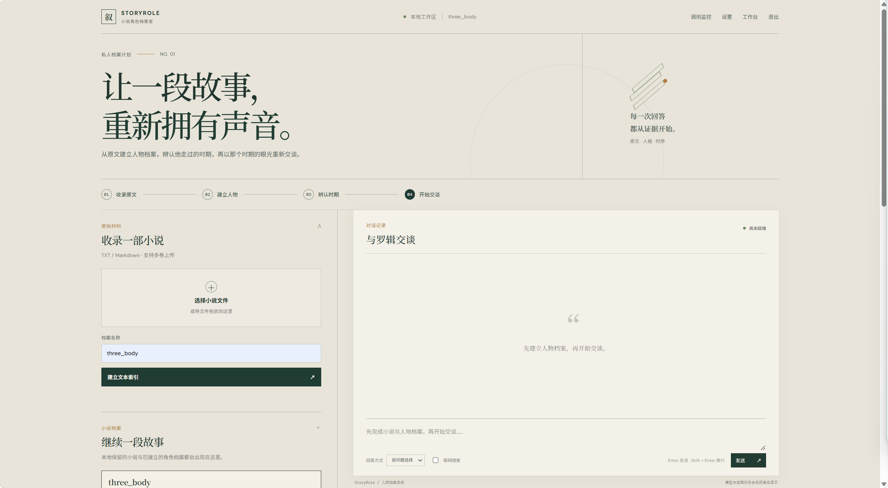
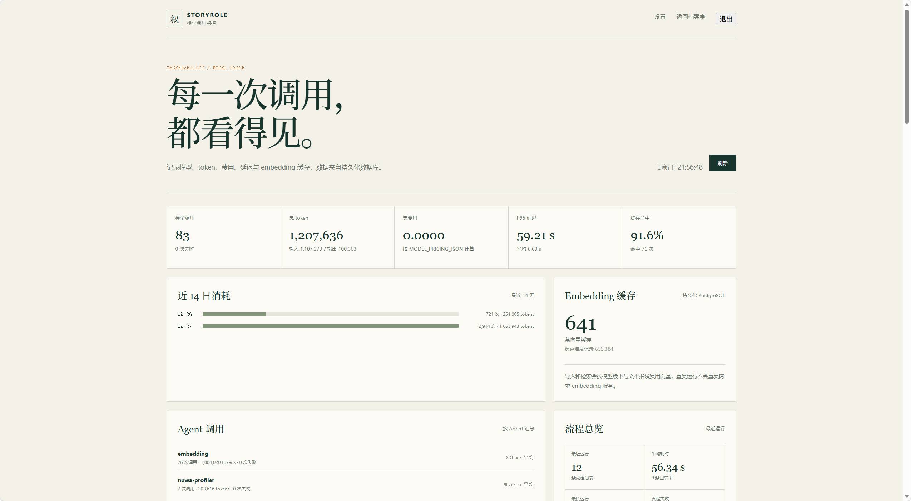

# StoryRole

StoryRole 是一个支持导入任意小说、创建自定义角色，并与小说角色进行沉浸式对话的多智能体平台。

它不把小说当成普通问答知识库，而是围绕“原文证据 + 人物画像 + 时期状态 + 对话记忆”组织一次回答，让角色在不同人生阶段保持相对稳定的认知、关系和表达方式。





## 核心能力

- **任意小说导入**：支持 TXT、Markdown，多文件导入并按章节和结构切分。
- **角色自定义创建**：用户输入角色名，系统先基于原文判断角色是否存在，再建立角色档案。
- **时期由用户决定**：默认只有一个时期；用户可以手动添加、编辑、删除和排序时期，也可以选择让 AI 根据原文提供范围建议。
- **女娲角色画像**：女娲 Agent 根据限定的小说证据生成结构化人格画像，并持久化版本、证据和时期关联。
- **时期独立画像**：每个时期单独调用画像接口，避免把角色早期、中期和后期人格混在一起。
- **动态关系状态**：关系状态保存在 PostgreSQL 中，根据对话逐步更新，而不是只从静态画像读取。
- **多 Agent 对话编排**：根据问题动态调用规划、检索、上下文整理、关系状态、角色推理、记忆决策和一致性审查 Agent。
- **Laya 默认问题规划**：Laya 负责快速判断问题需要的检索、记忆、关系和回答策略；不可用时自动降级到规则规划。
- **证据约束回答**：混合使用向量检索、BM25 和重排序，优先提供当前角色时期可用的原文证据。
- **记忆确认机制**：候选长期记忆先进入待确认状态，可由用户或模型二次判断后持久化。
- **业务级流程追踪**：每次导入、角色解析、时期分析、时期画像和对话都有独立 `trace_id`，接口会返回本次实际调用的 Agent、阶段耗时和 token。
- **调用监控**：`/models` 页面展示模型调用、Agent 汇总、流程阶段耗时、最近运行和 embedding 缓存。

## 一次请求的流程

```text
导入小说
  -> 解析章节、结构化切分
  -> Embedding + Chroma / BM25 索引

输入角色名
  -> character-resolver 判断原文中是否存在
  -> 用户手动定义时期，或请求 character-period-analysis 提供建议
  -> 每个时期调用 nuwa-profiler 生成并保存独立画像

用户提问
  -> query-planner / Laya 判断问题需求
  -> 记忆、关系、时间线和小说证据检索
  -> context-curator 整理上下文
  -> character-reasoning 或 role-cognition 形成角色立场
  -> 角色回答生成
  -> consistency-guard 检查人设和证据一致性
  -> 记忆候选与关系状态持久化
```

每个业务接口都先创建流程 Trace，下游 Agent 复用同一个 Trace。接口响应中的观测字段包括：

```json
{
  "trace_id": "...",
  "trace_summary": {},
  "trace_agents": [],
  "trace_steps": [],
  "trace_model_invocations": []
}
```

因此，前端展示的是“这一次保存或提问实际调用了什么”，而不是按时间范围拼出的历史统计。

## Agent 与 A2A

当前主要 Agent：

| Agent | 职责 |
| --- | --- |
| `character-resolver` | 判断角色是否出现在小说原文并保存角色索引 |
| `character-period-analysis` | 根据原文和用户时期名称提供时期建议 |
| `nuwa-profiler` | 生成并持久化角色时期画像 |
| `query-planner` | 判断本轮问题的执行需求，默认使用 Laya 后端 |
| `deep-question-planner` | 为深度问题生成受约束的检索计划 |
| `context-curator` | 整理画像、原文、记忆、关系和外部证据 |
| `relationship-state` | 读取或更新 PostgreSQL 中的动态关系状态 |
| `memory-decision` | 判断是否形成长期记忆候选 |
| `character-reasoning` / `role-cognition` | 形成角色立场、情绪和回答策略 |
| `consistency-guard` | 检查回答是否偏离画像、时期和证据边界 |
| `character-conversation` | 编排一次完整的沉浸式对话 |

Agent 当前默认在同一进程内通过 A2A 信封调用，同时提供 Agent Card 和 JSON-RPC 接口：

```text
GET  /api/v1/a2a/cards
GET  /api/v1/a2a/{agent_id}/agent-card.json
POST /api/v1/a2a/{agent_id}
```

后续可以通过 `STORYROLE_A2A_TRANSPORT=http` 将部分 Agent 拆成独立服务，而不改变业务编排协议。

## 技术栈

- **后端**：Python 3.13、FastAPI、Uvicorn
- **Agent**：LangChain、A2A、Laya 决策后端、MCP 扩展接口
- **模型**：OpenAI-compatible API、DashScope/Qwen、Ollama embedding
- **检索**：Chroma、BM25、Hybrid Fusion、Rerank
- **数据存储**：PostgreSQL、Redis、JSONL 审计中间产物
- **前端**：HTML、CSS、JavaScript 静态页面
- **依赖管理**：uv

## 目录结构

```text
app/
  agents/
    a2a/             # A2A 协议、Agent 注册和本地/HTTP 客户端
    storyrole/       # StoryRole 各类 Agent
    orchestration/   # 业务工作流和工具编排
  api/v1/            # FastAPI 接口，包括小说、StoryRole、A2A、模型监控
  observability/     # Trace、阶段耗时、模型调用和 token 统计
  rag/               # 文档读取、结构化切分、索引、检索和重排序
  storage/postgres/  # PostgreSQL schema 与连接
  storage/redis/     # Redis 连接和短期数据
  services/          # 小说导入和 StoryRole 服务
frontend/
  storyrole.html     # StoryRole 工作台
  models.html        # 模型、Agent 和流程监控
  settings.html      # 运行设置
docs/
  images/            # README 展示图
scripts/              # 初始化、导入、索引和评估脚本
tests/                # 单元测试和 Agent 行为测试
```

## 本地运行

### 1. 安装依赖

项目使用 `uv` 管理依赖：

```bash
uv sync
```

### 2. 启动 PostgreSQL 和 Redis

```bash
docker compose up -d postgres redis
```

默认端口：

| 服务 | 地址 |
| --- | --- |
| PostgreSQL | `localhost:5433` |
| Redis | `localhost:6379` |

### 3. 配置环境变量

复制 `.env.example` 为 `.env`，至少配置：

```env
POSTGRES_HOST=localhost
POSTGRES_PORT=5433
POSTGRES_USER=postgres
POSTGRES_PASSWORD=postgres
POSTGRES_DATABASE=three_body_agent

REDIS_HOST=localhost
REDIS_PORT=6379

STORYROLE_CHAT_MODEL=qwen3.7-plus
STORYROLE_NUWA_MODEL=qwen3.7-plus
STORYROLE_DECISION_BACKEND=laya
```

如果使用 DashScope 或其他 OpenAI-compatible 服务，还需要填写对应的 API Key 和 Base URL。Embedding 模型通过 `.env` 中的 embedding 配置读取；本地 Ollama embedding 也可以在运行设置中配置。

### 4. 初始化数据库并启动服务

```bash
uv run python scripts/init_postgres.py
uv run uvicorn app.main:app --host 127.0.0.1 --port 1314
```

访问：

- 工作台：http://127.0.0.1:1314/storyrole
- 调用监控：http://127.0.0.1:1314/models
- API 文档：http://127.0.0.1:1314/docs

### 5. 运行测试

```bash
uv run pytest -q
```

## 主要接口

```text
POST /api/v1/novels/imports
GET  /api/v1/novels/{novel_id}/imports/{import_id}

POST /api/v1/storyrole/novels/{novel_id}/characters/setup
POST /api/v1/storyrole/novels/{novel_id}/characters/{character_id}/period-analysis
POST /api/v1/storyrole/novels/{novel_id}/characters/{character_id}/periods/{period_id}/profile
POST /api/v1/storyrole/novels/{novel_id}/characters/{character_id}/chat

GET  /api/v1/models/dashboard
GET  /api/v1/models/traces/{trace_id}
```

画像和对话接口会在响应中返回本次请求的 Trace 明细，便于前端展示单次流程，也便于排查某个 Agent 的耗时和 token。

## 当前边界与后续方向

- Timeline Guard 当前以轻量边界判断为主，后续可以增强为章节/事件级校验。
- 关系状态已经动态持久化，后续可增加更细粒度的事件证据和衰减机制。
- 记忆候选已经支持待确认流程，后续可增加独立审核界面。
- 部分 Agent 可以按负载拆成独立 A2A 服务。
- 回答质量评估层可以基于已记录的 Trace、证据图和评估集继续建设。
- 需要持续增加不同小说、角色和时期的回归测试，防止人格漂移和未来知识泄漏。

## 项目定位

StoryRole 的核心不是让模型“知道更多剧情”，而是让它在有限证据和明确时期边界内，以一个具体角色的方式思考、记忆和回应。
